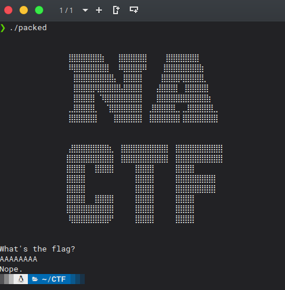
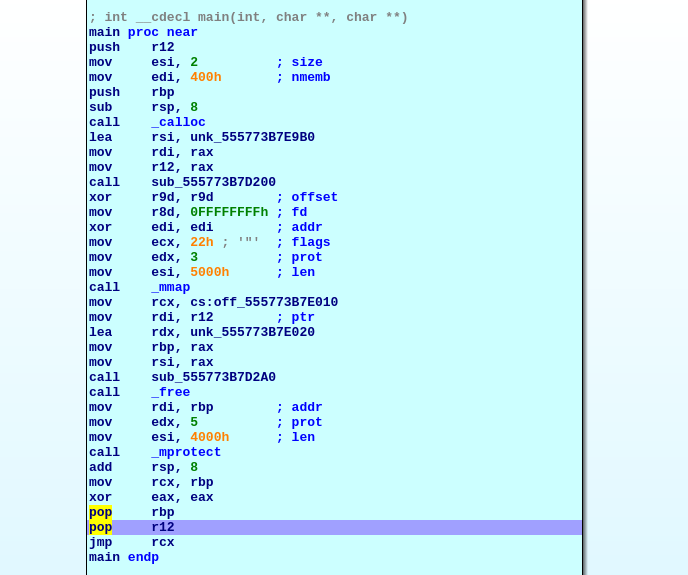
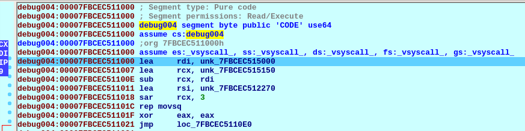
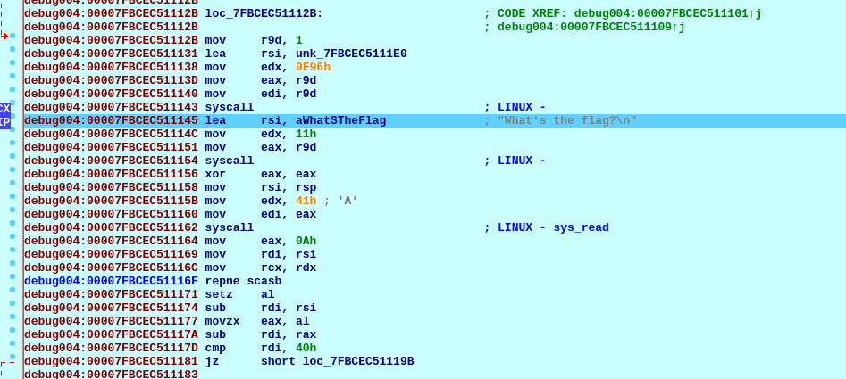
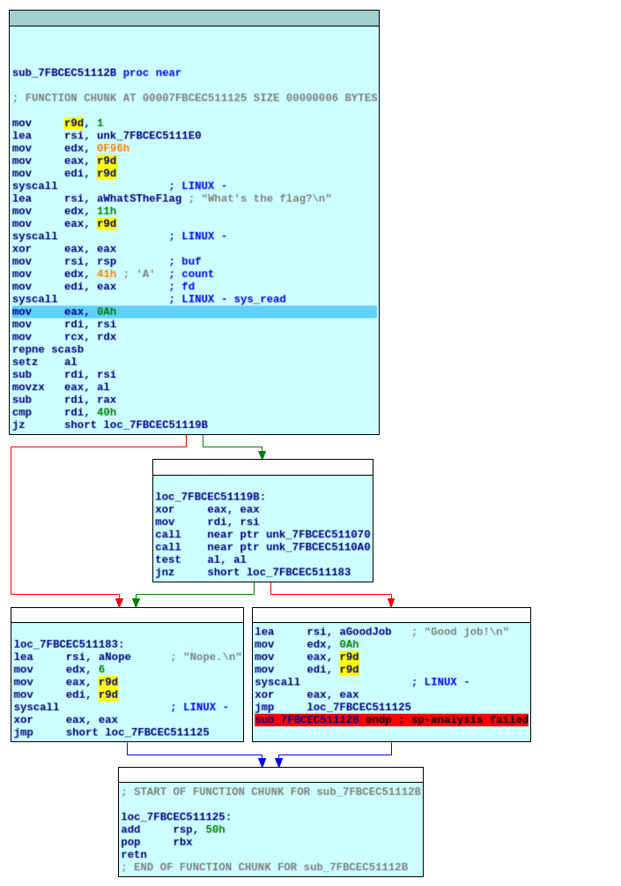
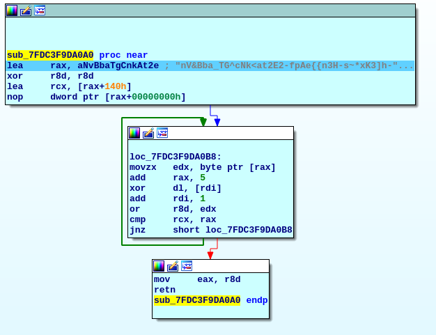

# Packed

Let's begin by running the binary. It asks us for the flag:



Not very helpfull. Let's move on to the analysis.

The thing with this binary is that it doesn't have all the code declared so IDA doesn't recognise the code when we analize it statically.

This is how the main function looks like:



So my approach was to put a breakpoint in that `jmp rcx` at the end of the main function and keep moving. When we jump we see that we are at different segment called debug004.



We keep moving until we hit where the code prints and ask for input:



Now that we know where the code we want is we can create a function in IDA and get the graph:



The first check that the program makes is if the length of the input is 0x40 so now we know the length.

Then, we keep going until we hit unk_7FDC3F9DA0A0, which looks interesting because it's the last function before saying right or wrong. We create an IDA function at that position and we get the graph:



It is loading the contents of that variable into `rax` and then it's comparing our input in `rdi` (I found out this after checking the contents of `rdi` in runtime). But as we can see, its picking the letters that are in positions divisible by 5 and comparing against our string.

So we dump the contents of that variable:


```
nV&Bba_TG^cNk<at2E2-fpAe{{n3H-s~*xK3]h-NlXIorf;g^Y_cB(gu",}Tn{vq!po`K@4~J{)c9i=?k3fZ,1+Ib_n.GgFg{0gK_f;ngblEY,1mRIjn?F89_8%oudB]),1w14%d+zfxnS{dDtc?<w_lVkD3Z`usvzN+J3o/_lnqK9@_#~C/s{=P64KW(-v3z=&3jren_x*$04r9njn0S,Py/%n#_98|0s^;~(pw#fW4p-B)c=*sG3MX8(_a\&ms-zS:mBN~]hi6zw_;(w5m5LdAV0mYv47"]xEUibHUtNRuYA4hya"[+Ke&fD2}?^N$*nactf!
```


Because we know the length (0x40 or 64) we can make a little script to take the flag:


```python
data = 'nV&Bba_TG^cNk<at2E2-fpAe{{n3H-s~*xK3]h-NlXIorf;g^Y_cB(gu",}Tn{vq!po`K@4~J{)c9i=?k3fZ,1+Ib_n.GgFg{0gK_f;ngblEY,1mRIjn?F89_8%oudB]),1w14%d+zfxnS{dDtc?<w_lVkD3Z`usvzN+J3o/_lnqK9@_#~C/s{=P64KW(-v3z=&3jren_x*$04r9njn0S,Py/%n#_98|0s^;~(pw#fW4p-B)c=*sG3MX8(_a\&ms-zS:mBN~]hi6zw_;(w5m5LdAV0mYv47"]xEUibHUtNRuYA4hya"[+Ke&fD2}?^N$*nactf!'

for i in range(64):
    print(data[i*5], end="")
print()
```

We run it and we get the flag:

`nactf{s3lf_unp4ck1ng_b1n_d1dnt_3v3n_s4v3_4ny_sp4c3_smh_mV4EUYae}`
